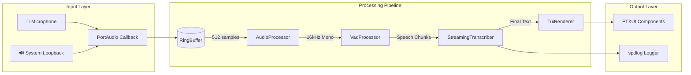
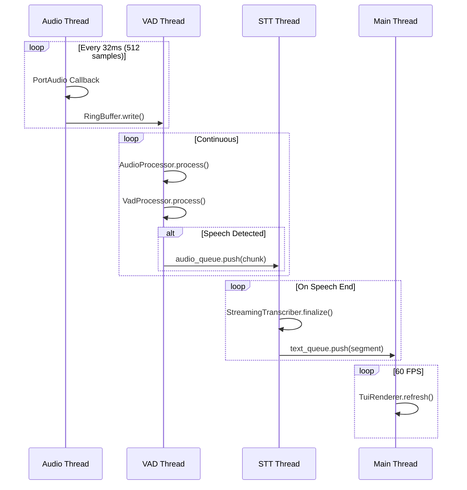

# Architecture Documentation

## Overview

Real-Time Audio-to-Subtitles is a **production-grade, cross-platform C++ application** for real-time speech-to-text transcription. Built with state-of-the-art, modular, and cutting-edge technologies, it processes audio through a sophisticated multi-stage pipeline with sub-100ms latency.

### Design Philosophy

- **Modularity**: Each component is independently testable and replaceable
- **Zero-Copy Where Possible**: Minimizes memory allocation in hot paths
- **Fail-Fast with Recovery**: Errors propagate via `Result<T>`, enabling graceful degradation
- **Thread Safety by Design**: Lock-free structures and atomic operations
- **Configuration Flexibility**: Identical options across CLI, ENV, and INI

---

## System Requirements

| Component | Minimum | Recommended |
|-----------|---------|-------------|
| **OS** | Windows 10 | Windows 11 |
| **CPU** | 4 cores, SSE4.2 | 8+ cores, AVX2 |
| **RAM** | 4 GB | 8+ GB |
| **Disk** | 500 MB | 1+ GB |
| **GPU** | None (CPU-only) | CUDA 11.8+ (optional) |

### Runtime Dependencies

| Library | Version | Purpose | Integration |
|---------|---------|---------|-------------|
| ONNX Runtime | 1.16+ | Silero VAD neural inference | Dynamic link |
| whisper.cpp | Latest | OpenAI Whisper STT engine | Static link |
| PortAudio | 19.7+ | Cross-platform audio I/O | CMake FetchContent |
| SpeexDSP | 1.2.1 | High-quality audio resampling | CMake FetchContent |
| FTXUI | 6.1+ | Terminal User Interface | CMake FetchContent |
| spdlog | 1.16+ | Structured logging | Header-only |
| CLI11 | 2.6+ | Command-line parsing | Header-only |

---

## Architecture

### High-Level Pipeline



### Thread Model & Data Flow



### Modular Component Architecture

| Module | Responsibility | Interface | Pattern |
|--------|----------------|-----------|---------|
| **audio::AudioCapture** | Device enumeration, PCM capture | Factory `create()` | RAII, Observer |
| **audio::AudioProcessor** | Downmix, resample | Pure function | Strategy |
| **audio::RingBuffer** | Thread-safe audio buffer | Lock-protected | Producer-Consumer |
| **vad::VadProcessor** | 6-stage speech detection | Factory `create()` | Pipeline |
| **stt::SttEngine** | Whisper.cpp inference | Factory `create()` | Facade |
| **stt::StreamingTranscriber** | Sliding window, dedup | Stateful processor | State Machine |
| **ui::TuiRenderer** | FTXUI components | Event-driven | MVC |
| **core::MetricsCollector** | APM metrics | Singleton | Observer |

### Thread Communication

```
┌────────────────┐     ┌─────────────────┐     ┌────────────────┐
│  Audio Thread  │     │   VAD Thread    │     │   STT Thread   │
│                │     │                 │     │                │
│  PortAudio CB  │────▶│  RingBuffer     │     │                │
│                │     │  ───────────    │     │                │
│                │     │  AudioProcessor │     │                │
│                │     │  VadProcessor   │────▶│  ThreadSafe-   │
│                │     │                 │     │  Queue<Chunk>  │
└────────────────┘     └─────────────────┘     │                │
                                               │  Streaming-    │
                                               │  Transcriber   │
                                               └───────┬────────┘
                                                       │
                                                       ▼
                       ┌─────────────────┐     ┌────────────────┐
                       │   Main Thread   │◀────│  ThreadSafe-   │
                       │                 │     │  Queue<Text>   │
                       │  TuiRenderer    │     └────────────────┘
                       │  InputHandler   │
                       └─────────────────┘
```

### Module Structure

```
src/
├── audio/              # Audio capture and processing
│   ├── audio_capture.h/cpp    - PortAudio wrapper, device enumeration
│   ├── audio_processor.h/cpp  - Downmix + resample pipeline
│   ├── resampler.h/cpp        - SpeexDSP resampling
│   └── ringbuffer.h           - Thread-safe circular buffer
├── config/             # Configuration management
│   └── app_config.h/cpp       - CLI/ENV/INI config loading
├── core/               # Application lifecycle
│   ├── application.h/cpp      - Main application orchestration
│   ├── common_types.h         - Shared data structures
│   ├── constants.h            - Compile-time constants
│   ├── metrics_collector.h/cpp - APM metrics (singleton)
│   └── result.h               - Error handling (std::expected)
├── output/             # Logging infrastructure
│   └── logging.h/cpp          - spdlog initialization + macros
├── stt/                # Speech-to-Text
│   ├── stt_engine.h/cpp       - whisper.cpp wrapper
│   └── streaming_transcriber.h/cpp - Sliding window, dedup
├── ui/                 # Terminal User Interface
│   ├── tui_renderer.h/cpp     - FTXUI main UI
│   └── tui_settings.h/cpp     - Settings panel
├── utils/              # Utilities
│   ├── config_file.h          - INI parser (header-only)
│   ├── signal_handler.h/cpp   - Ctrl+C handling
│   ├── thread_metrics.h/cpp   - CPU usage tracking
│   ├── thread_safe_queue.h    - Blocking queue (header-only)
│   └── wer_calculator.h       - Word Error Rate (header-only)
└── vad/                # Voice Activity Detection
    └── vad_processor.h/cpp    - Silero VAD with 6-stage pipeline
```

---

## TUI Controls

The Terminal UI uses tabbed navigation:

| Key | Action |
|-----|--------|
| `←` / `→` | Switch between tabs |
| `↑` / `↓` | Navigate within tab content |
| `Enter` | Select/Confirm |
| `Escape` | Exit application |

### Available Tabs

1. **Logs** - Live subtitle display with scrolling history
2. **Devices** - Audio input device selector
3. **Audio** - Input gain settings
4. **VAD** - Voice Activity Detection tuning
5. **STT** - Speech-to-Text settings
6. **System** - Resource monitoring
7. **Help** - Keyboard shortcuts

## Configuration Reference

### Priority Order

Configuration is loaded in this order (later overrides earlier):

1. **Defaults** (compiled into AppConfig)
2. **Config File** (`config.ini` in working directory)
3. **Environment Variables** (`SUBTITLER_*` prefix)
4. **CLI Arguments** (highest priority)

---

### CLI Arguments

| Flag | Type | Default | Description |
|------|------|---------|-------------|
| `--ui` | flag | false | Enable Terminal UI (required for interactive use) |
| `--list-devices` | flag | false | List audio devices and exit |
| `--device <N>` | int | -1 | Audio device index (-1 = default) |
| `--model <PATH>` | string | `models/ggml-base.bin` | Whisper model path |
| `--language <CODE>` | string | `en` | ISO 639-1 language code |
| `--threads <N>` | int | 4 | CPU threads for inference |
| `--gpu` | flag | true | Enable GPU acceleration |
| `--flash-attn` | flag | true | Enable Flash Attention |
| `--vad-threshold <F>` | float | 0.5 | Speech probability threshold (0.0-1.0) |
| `--vad-energy-threshold <F>` | float | 0.001 | RMS energy gate |
| `--vad-smoothing <F>` | float | 0.3 | EMA smoothing alpha |
| `--vad-hangover <N>` | int | 20 | Hangover frames after speech |
| `--vad-preroll <N>` | int | 6 | Pre-roll frames before speech |
| `--vad-adaptive` | flag | true | Adaptive threshold |
| `--stt-step <MS>` | int | 2000 | Transcription step interval |
| `--stt-keep <MS>` | int | 500 | Audio context keep buffer |
| `--stt-max <MS>` | int | 10000 | Maximum audio window |
| `--log-level <LEVEL>` | string | `info` | Log level: trace/debug/info/warn/error |
| `--log-file <PATH>` | string | `logs/realtime-subtitler.log` | Log file path |
| `--verbose` | flag | false | Enable verbose output |
| `--config <PATH>` | string | `config.ini` | Config file path |
| `--version` | flag | - | Show version and exit |
| `--help` | flag | - | Show help and exit |

---

### Environment Variables

All settings can be configured via environment variables with the `SUBTITLER_` prefix:

| Variable | Corresponding CLI | Example |
|----------|-------------------|---------|
| `SUBTITLER_DEVICE` | `--device` | `SUBTITLER_DEVICE=0` |
| `SUBTITLER_MODEL` | `--model` | `SUBTITLER_MODEL=models/ggml-small.bin` |
| `SUBTITLER_LANGUAGE` | `--language` | `SUBTITLER_LANGUAGE=es` |
| `SUBTITLER_THREADS` | `--threads` | `SUBTITLER_THREADS=8` |
| `SUBTITLER_USE_GPU` | `--gpu` | `SUBTITLER_USE_GPU=false` |
| `SUBTITLER_FLASH_ATTN` | `--flash-attn` | `SUBTITLER_FLASH_ATTN=true` |
| `SUBTITLER_VAD_THRESHOLD` | `--vad-threshold` | `SUBTITLER_VAD_THRESHOLD=0.6` |
| `SUBTITLER_VAD_ENERGY_TH` | `--vad-energy-threshold` | `SUBTITLER_VAD_ENERGY_TH=0.002` |
| `SUBTITLER_VAD_SMOOTHING` | `--vad-smoothing` | `SUBTITLER_VAD_SMOOTHING=0.4` |
| `SUBTITLER_VAD_HANGOVER` | `--vad-hangover` | `SUBTITLER_VAD_HANGOVER=15` |
| `SUBTITLER_VAD_PREROLL` | `--vad-preroll` | `SUBTITLER_VAD_PREROLL=8` |
| `SUBTITLER_VAD_ADAPTIVE` | `--vad-adaptive` | `SUBTITLER_VAD_ADAPTIVE=true` |
| `SUBTITLER_STT_STEP_MS` | `--stt-step` | `SUBTITLER_STT_STEP_MS=1500` |
| `SUBTITLER_STT_KEEP_MS` | `--stt-keep` | `SUBTITLER_STT_KEEP_MS=750` |
| `SUBTITLER_STT_MAX_MS` | `--stt-max` | `SUBTITLER_STT_MAX_MS=15000` |
| `SUBTITLER_LOG_LEVEL` | `--log-level` | `SUBTITLER_LOG_LEVEL=debug` |
| `SUBTITLER_LOG_FILE` | `--log-file` | `SUBTITLER_LOG_FILE=app.log` |
| `SUBTITLER_VERBOSE` | `--verbose` | `SUBTITLER_VERBOSE=true` |

---

### Config File (`config.ini`)

```ini
# =============================================================================
# Real-Time Audio-to-Subtitles Configuration
# Priority: CLI > ENV > Config File > Defaults
# =============================================================================

# -----------------------------------------------------------------------------
# Audio Settings
# -----------------------------------------------------------------------------
device = -1                     # -1 = default device, or device index

# -----------------------------------------------------------------------------
# Speech-to-Text (Whisper)
# -----------------------------------------------------------------------------
model = models/ggml-base.bin    # Whisper model file
language = en                   # Language code (en, es, fr, de, zh, ja, etc.)
n_threads = 4                   # CPU threads for inference
use_gpu = true                  # Enable GPU acceleration
flash_attn = true               # Enable Flash Attention

# -----------------------------------------------------------------------------
# Voice Activity Detection (Silero VAD)
# -----------------------------------------------------------------------------
vad_model = models/silero_vad.onnx
vad_threshold = 0.5             # Speech probability threshold (0.0-1.0)
vad_energy_threshold = 0.001    # RMS energy gate threshold
vad_smoothing_alpha = 0.3       # EMA smoothing (0.1=stable, 0.5=responsive)
vad_hangover_frames = 20        # Frames to extend after speech ends
vad_pre_roll_frames = 6         # Frames to include before speech trigger
vad_adaptive_threshold = true   # Enable adaptive threshold adjustment

# -----------------------------------------------------------------------------
# Streaming Transcription
# -----------------------------------------------------------------------------
stt_step_ms = 2000              # Transcribe every N ms of new audio
stt_keep_ms = 500               # Audio context to keep between windows
stt_max_length_ms = 10000       # Maximum sliding window size

# -----------------------------------------------------------------------------
# Logging
# -----------------------------------------------------------------------------
log_level = info                # trace, debug, info, warn, error
log_file = logs/realtime-subtitler.log
verbose = false
```

---

## Key Components

### AudioCapture

Factory-based audio capture with WASAPI/PortAudio backend.

```cpp
// Create audio capture instance
auto capture = audio::AudioCapture::create(16000, 512);
capture->start(device_index);

// Read audio chunks
core::AudioChunk chunk = capture->read_chunk(8000);
```

### VadProcessor

Multi-stage VAD pipeline with Silero neural inference:

1. **RMS Energy Gate** - Instant silence rejection
2. **Silero VAD** - ONNX neural network inference
3. **EMA Smoothing** - Reduces jitter/false triggers
4. **Hangover Mechanism** - Prevents clipped endings
5. **Pre-Roll Buffer** - Captures audio before trigger
6. **Adaptive Threshold** - Adjusts to noise floor

```cpp
auto vad = vad::VadProcessor::create("models/silero_vad.onnx");
float raw_prob, smoothed_prob;
auto is_speech = vad->process(audio_frame, raw_prob, smoothed_prob);
```

### SttEngine

Whisper.cpp wrapper with optimized inference:

```cpp
auto engine = stt::SttEngine::create("models/ggml-base.bin", config);
auto result = engine->transcribe(audio_buffer);
```

### StreamingTranscriber

Sliding window transcription with deduplication:

```cpp
stt::StreamingTranscriber transcriber(engine, config);
transcriber.push_audio(samples);
auto segment = transcriber.finalize();  // On speech end
```

---

## Error Handling

The application uses `core::Result<T>` (C++23 `std::expected`) for explicit error handling:

```cpp
// Factory returns Result
auto capture_result = audio::AudioCapture::create();
if (!capture_result) {
    LOG_ERROR("Failed: {}", capture_result.error());
    return 1;
}
auto capture = std::move(*capture_result);
```

---

## Performance Metrics

Collected by `core::MetricsCollector` singleton:

| Metric | Description |
|--------|-------------|
| RTF (Real-Time Factor) | processing_time / audio_duration (target < 1.0) |
| VAD Latency | Time for single VAD frame inference |
| Inference Latency | Whisper.cpp transcription time |
| Pipeline Latency | End-to-end audio → subtitle delay |
| Throughput | Characters per second |
| Audio Fill Rate | Samples/second being processed |

---

## Testing

### Test Suites

| Suite | Command | Tests |
|-------|---------|-------|
| **Unit** | `.\build\unit_tests.exe` | 80+ tests |
| **Integration** | `.\build\integration_tests.exe` | 7 tests |
| **Benchmarks** | `.\build\benchmarks.exe` | 5 categories |

### Coverage

```powershell
.\coverage.ps1  # Generates HTML report in coverage/report/
```

---

## Build System

### CMake Configuration

```powershell
cmake -B build -DCMAKE_BUILD_TYPE=Release
cmake --build build --config Release
```

### Build Targets

| Target | Description |
|--------|-------------|
| `realtime-subtitler` | Main application executable |
| `realtime-subtitler-core` | Core static library |
| `unit_tests` | Unit test executable |
| `integration_tests` | Integration test executable |
| `benchmarks` | Benchmark executable |

---

## License

MIT License. See [LICENSE](../LICENSE) for details.
